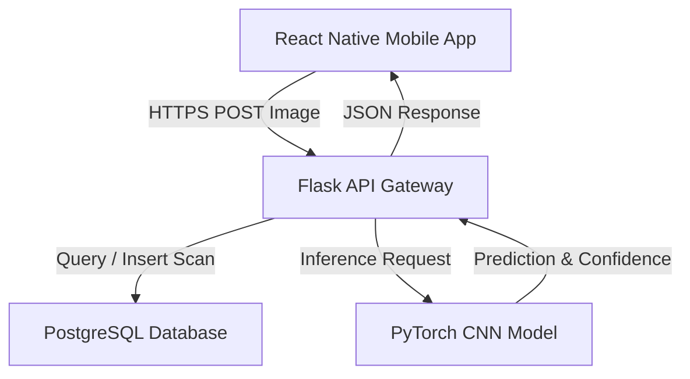
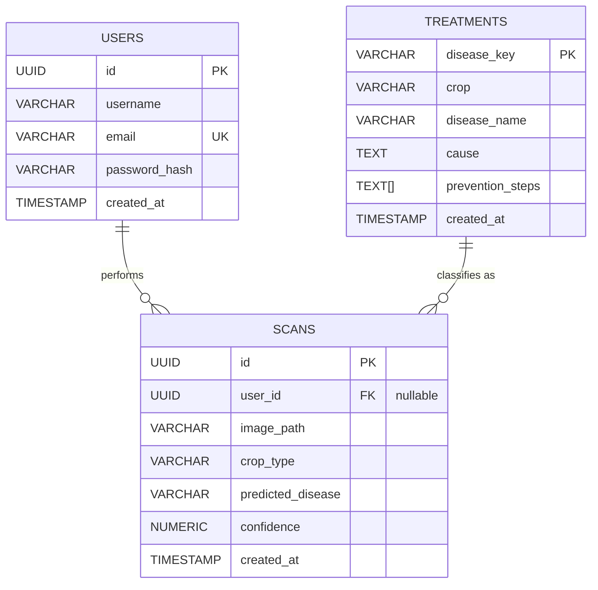
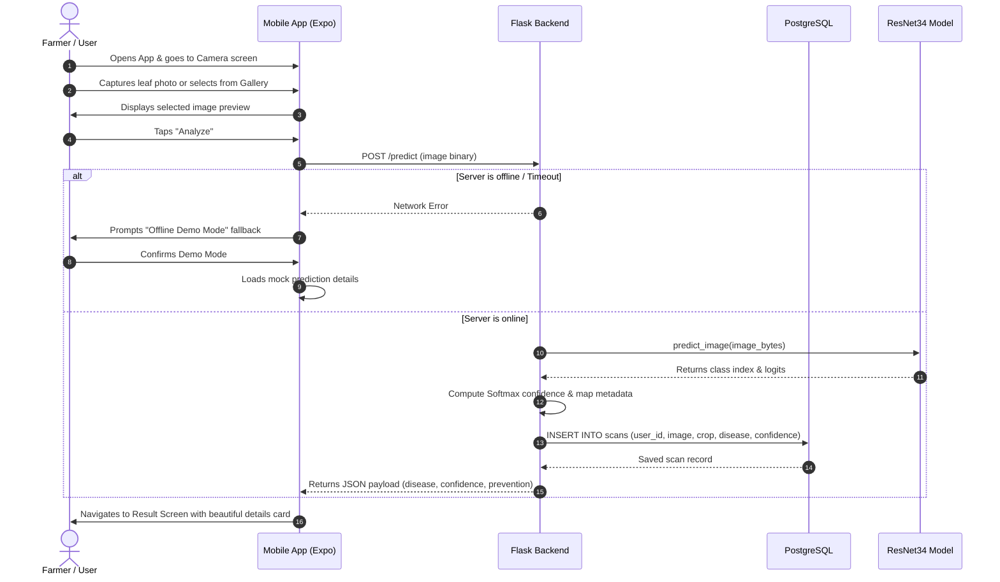

# System Design: AgroScan Plant Disease Detection System

This document outlines the architecture, database schema, machine learning pipeline, API contracts, and user flows for the AgroScan system.

---

## 1. System Architecture

AgroScan uses a client-server architecture consisting of a mobile frontend, an AI-powered inference backend, and a PostgreSQL database.



- **Frontend (Mobile App)**: Built with React Native Expo, providing image capture, library picking, scan analysis visualization, and treatment recommendations.
- **Backend (Flask API)**: Orchestrates request handling, database persistence, and runs PyTorch model inference.
- **Database (PostgreSQL)**: Stores users, scan histories, and detailed crop disease descriptions and treatments.
- **AI Model (PyTorch ResNet/CNN)**: Classifies leaf images into 38 distinct crop-disease categories.

---

## 2. Database Schema (PostgreSQL)

The database tracks users, saves crop scans (referencing images and results), and stores treatment/prevention lookup data.



---

## 3. ML Model Input & Output Formats

### Input Format
- **Data Source**: RGB images of plant leaves (JPG, PNG, WEBP).
- **Preprocessing Pipeline**:
  1. **Resize**: Rescaled to $128 \times 128$ pixels.
  2. **Tensor Conversion**: Scaled pixel values to $[0.0, 1.0]$.
  3. **Batch Dimension**: Unsqueezed to shape `[1, 3, 128, 128]`.
- **Normalization** (if applicable): Channel-wise mean and standard deviation.

### Output Format
- **Logits**: Vector of shape `[1, 38]` containing classification scores.
- **Softmax Probability**: Softmax applied to logits to obtain prediction probabilities.
- **Prediction Label**: Argmax maps index to class key (e.g., `Tomato___Bacterial_spot`).
- **Confidence Score**: The highest class probability, converted to a percentage (e.g., `96.45%`).

---

## 4. API Contracts

### 4.1. Health Check
Checks backend service and database connectivity.
- **Endpoint**: `GET /health`
- **Response `200 OK`**:
```json
{
  "status": "healthy",
  "database": "connected",
  "model_loaded": true,
  "timestamp": "2026-06-08T10:00:00Z"
}
```

### 4.2. Image Classification & Disease Detection
Submit a leaf image for disease diagnosis.
- **Endpoint**: `POST /predict`
- **Content-Type**: `multipart/form-data`
- **Request Body**:
  - `image` or `file`: Binary image data.
  - `user_id` (optional): UUID of the logged-in user.
- **Response `200 OK`**:
```json
{
  "prediction": "Tomato___Bacterial_spot",
  "confidence": 98.45,
  "crop": "Tomato",
  "disease": "Bacterial Spot",
  "cause": "Caused by four species of Xanthomonas bacteria, invading wet plant tissue.",
  "prevention": [
    "Use pathogen-free certified seeds.",
    "Minimize overwatering and overhead irrigation.",
    "Apply copper-containing bactericides."
  ]
}
```
- **Response `400 Bad Request`**:
```json
{
  "error": "No image file uploaded."
}
```

### 4.3. User Scan History
Retrieve past scans for a specific user.
- **Endpoint**: `GET /scans`
- **Query Params**: `user_id=<UUID>`
- **Response `200 OK`**:
```json
{
  "scans": [
    {
      "id": "e932b13c-fb82-4148-8df0-1014cc67fb30",
      "image_path": "uploads/20260608_101530.jpg",
      "crop_type": "Tomato",
      "predicted_disease": "Tomato___Bacterial_spot",
      "confidence": 98.45,
      "created_at": "2026-06-08T09:15:30Z"
    }
  ]
}
```

---

## 5. User Interaction Flow


